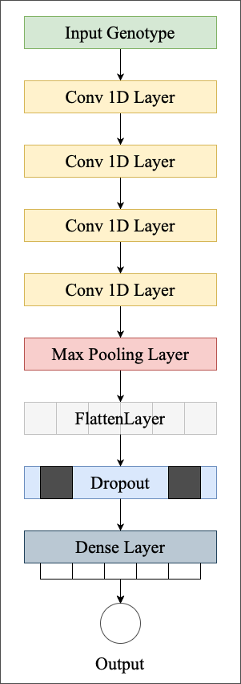

Predicting Phenotypes From Novel Genomic Markers Using Deep Learning
- - -
This is the code repository for the above-mentioned paper. It contains the following files.
> Train Test Split script file: sv_data_split.py  
> Training script: sv_model_train.py  
> Testing script: sv_model_train.py  

The following figure shows the developed model in this paper:   

{width="400" height="600" style="display: block; margin: 0 auto"}
